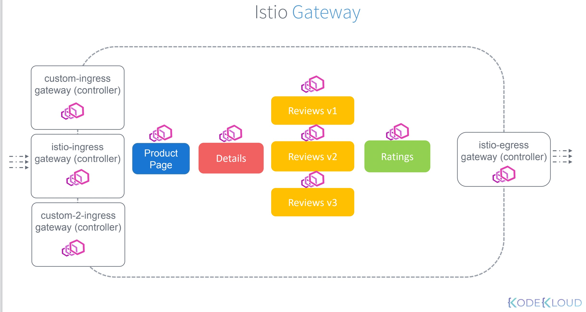

gateway分为 


## [ingressgateway](https://istio.io/latest/docs/reference/config/networking/gateway/)：
    * 定义 输入的host,port
    * 使用的istio-ingress gateway
    * 不是sidecar,在mesh边缘上

<font color=green>ingressgateway 相当于nginx-controller,区别是nginx-controller只有一个，ingressgateway可以自定义，有很多个！</font>

```
ingress:
    nginxController(*,80,443)------>ingressRule-->service

istio:
    istio-isgresss-ingressgateway("my.site1",8080)--->virtualService-->service
    istio-isgresss-ingressgateway("my.site2",8081)--->virtualService-->service
    istio-isgresss-ingressgateway("my.site3",8082)--->virtualService-->service
```
[book-gateway](book-gateway.yaml)
###查询命令
```
kubectl get Gateway.v1beta1.networking.istio.io
kubectl describe Gateway.v1beta1.networking.istio.io bookinfo-gateway
```
* engressgateway:负责出口的流量管理


