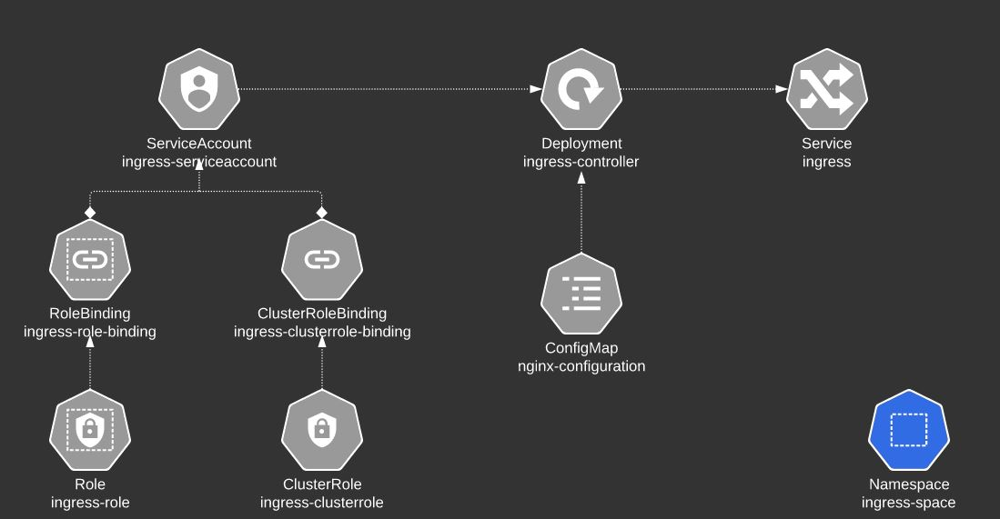

P298页
https://kubernetes.io/docs/concepts/services-networking/ingress

https://kubernetes.io/docs/concepts/services-networking/ingress/#path-types


<font color=blue>kubectl get ingress -n app-space -o yaml</font>
### LoadBalance 与nodePort Service的区别
    LoadBalance=nodePort+proxy


*说明*：nodeport默认是3000以上的端口的，所以需要转换端口，**前面有个nginx**，而如果使用云厂商的K8s,可以把服务设置成为LoadBalance,K8s分配好端口后，向云厂商**申请一个SLB**，用于端口的转换,每个SLB当然也会产生对应的**费用**。

### 为什么需要ingress(layer 7 vs layer 4)

* 因为 nodeport,loadbalance service只有**负载相同的服务**的功能，如何需要负载不同的服务，需要 ingress。
* ingress可以集成 TLS功能，nodePort，loadbalance不具备，有个ingress,就把TLS 从pod 应用解耦出来了
* ingress 是根据设定的规则，分发给nodeport服务的。


### Ingress的组成

* IngressController:这是执行**分发规则的应用**,需要单独部署。
* IngressResource：这里是**分发规则的设置**，TLS设置等


### IngressController
[IngressController的安装手册](controller/nginx-ingress_安装.md)

**nginx,istio**,GCP LoadBalance是常用的三个controller.



一个ingress部署由以下几方面组成需要如下
```
Namespaces: ingress-space
Deployment:规则匹配应该
ConfigMap:传递给Deployment配置,nginx-configuration
Service:对外暴露 ingress服务端口

ingress由于需要访问并监控代理服务的状态，所有需要一些k8s访问资源的权限，权限涉及到

ServiceAccount:ingress deployment以此用户运行
Role,Rolebing:规定哪些资源可以访问，哪些操作被允许！
ClusterRole,ClusterRoleBinding

```

### IngressResources
有以下三种规则可以设置：

* defaultBackend:所有的不匹配 执行此规则(singleRule.yaml)
* host 匹配规则(hostRule.yaml)
* path 匹配规则(pathRule.yaml)

```
    【host匹配】-->【pat匹配】->匹配成功，转发给设置的服务
                          | 
                          |
                          失败 转发给【defaultBackend】对应的服务

rules:{http,host} #host用于【host 匹配规则】
http:{paths}
paths:{path,pathType,backend}
backend:{service.name,service.port}
```

ingress是在namespace下的，不同namespace的匹配规则统统生效。
```
    Ingress-Controller :read all ingress-resource.
    
    |ns1| 
        ingress-ns1: 
            /pay==>pay.service.ns1

    |ns2|: 
        ingress-ns2 :
            /eat==>eat.service.ns2,/watch=>video.service.ns2
```

PathType
```
Exact: 完全比配给出规则
Prefix: /分割后，splits出来的元素，完全匹配
```

| 类型     | 规则 | 输入 | 匹配
| --      | -   | -    |-   |
| Exact   | /foo   | /foo/    | N  |
| Prefix   | /foo/bar   | /foo/bar/    | Y  |
| Prefix   | /foo/bar   | /foo/bar     | Y  |
| Prefix   | /foo/bar   | /foo/bars    | N  |
