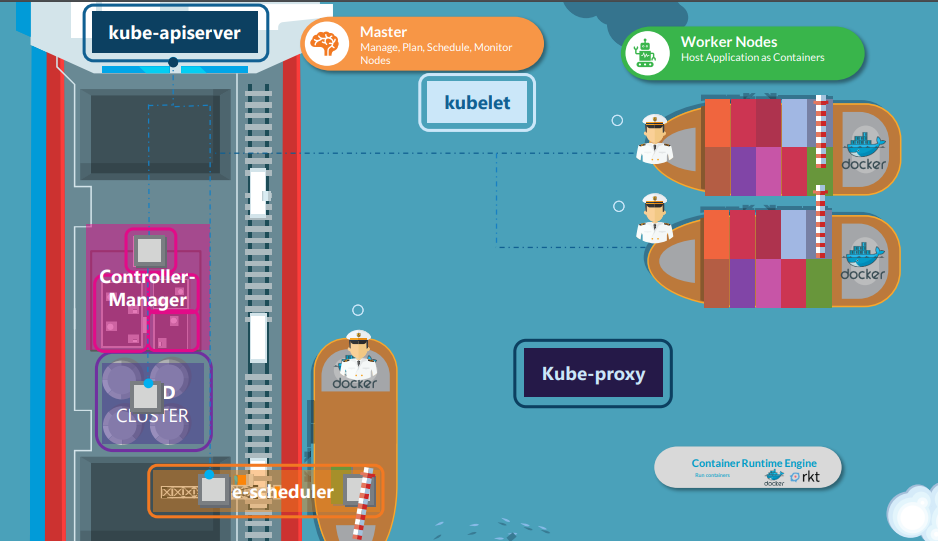
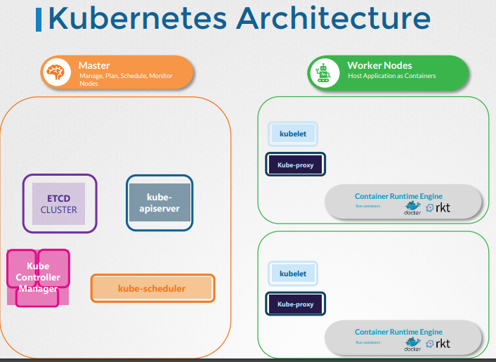

# Kubenetes基础构架

  
  Kubernetes 是一个开源的容器编排平台，用于自动化部署、扩展和管理容器化应用程序。Kubernetes 提供了一种可移植的、可扩展的、开放的平台，可以帮助开发人员更有效地构建和管理应用程序。
  
- 10,000 Feet Look at the Kubernetes Architecture

  
  
  

Kubernetes 的架构可以分为以下几个组件：

- Master节点：Master节点是Kubernetes的控制面板，用于管理整个集群。Master节点包含了以下几个组件：
API Server：作为 Kubernetes 系统的前端，所有的请求都由它来接收和处理，并将结果返回给客户端。
- Controller Manager：用于管理控制器，确保容器在运行过程中始终处于期望的状态。
- Scheduler：根据容器的资源需求和可用性，将容器部署到不同的节点上。
Node节点：Node节点是运行应用程序和容器的主机，也被称为工作节点。每个Node节点都有以下组件：
- Kubelet：作为主节点的代理，负责管理节点上的容器和容器组。
- kube-proxy：用于维护网络代理和负载均衡，确保应用程序能够在Kubernetes集群中进行通信。
容器运行时：通常为Docker，负责运行容器。
- etcd：etcd是Kubernetes集群的分布式键值存储系统，用于存储Kubernetes集群的所有状态信息。
- apiserver: API Server 是 Kubernetes 集群中的一个核心组件，它是 Kubernetes 控制面板的前端组件，负责提供 Kubernetes API，接收和处理来自客户端（如 kubectl 命令行工具）的请求，并将结果返回给客户端。API Server 还负责对集群中的各种资源对象进行认证、授权和准入控制等操作。

