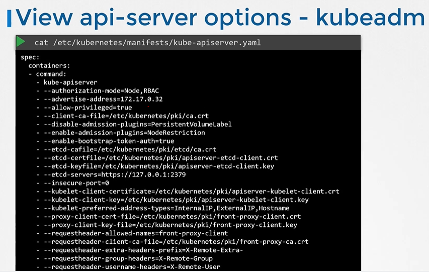

# Kube API Server


#### Kube-apiserver is the primary component in kubernetes.
- Kube-apiserver 负责认证、验证请求，从 ETCD 键值存储中检索和更新数据。实际上，kube-apiserver 是唯一直接与 etcd 数据存储交互的组件。其他组件，如 kube-scheduler、kube-controller-manager 和 kubelet，使用 API-Server 在各自的领域更新集群。
  
  
  

## View kube-apiserver - Kubeadm
- kubeadm 把 kube-apiserver作为一个pod部署在kube-system 命名空间下.它存在在master node上面
  ```
  $ kubectl get pods -n kube-system
  ```
   
  
   
## 查看 kube-apiserver的配置 - Kubeadm

  ```
  $ cat /etc/kubernetes/manifests/kube-apiserver.yaml
  ```
  
  
