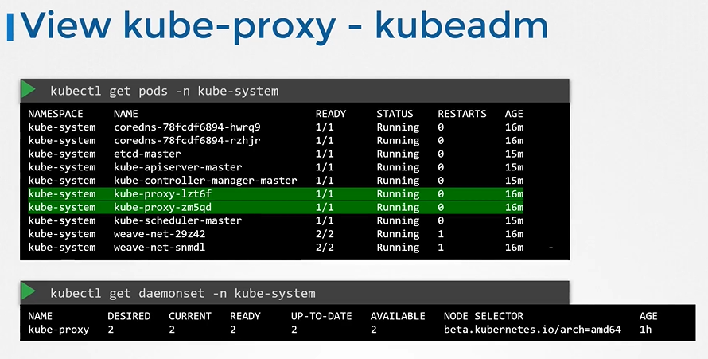

# Kube Proxy


在 Kubernetes 集群中，每个 Pod 都可以访问其他任何 Pod，这是通过向集群部署一个 Pod 网络 来实现的。

- 每个node上都会有 Kube-Proxy is 运行.
  
  
## kube-proxy pod查询 - kubeadm

  ```
  $ kubectl get pods -n kube-system
  ```
  
  
  