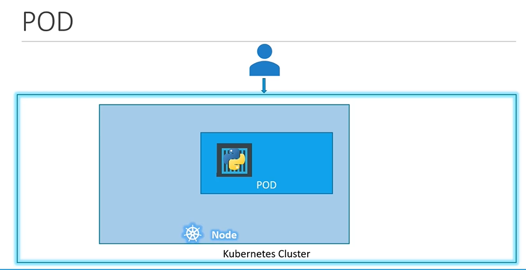

# Pods
Pod 是 Kubernetes 集群中的最小调度单元，是一组紧密关联的容器集合，它们共享同一个网络命名空间、存储卷、主机名和 IP 地址等资源。Pod 的出现主要是为了方便容器之间的通信和共享资源。


- POD 简介
- 如何部署Pod?

#### Kubernetes不会把应用直接部署在 工作节点上.

  
  
这是一个单节点 Kubernetes 集群，其中有一个应用程序的实例运行在一个 Docker 容器中，该容器被封装在 Pod 中。



#### Pod 与运行应用程序的容器具有一对一的关系。


  
  
## Multi-Container PODs
- 一个 Pod 可以拥有多个容器，除了它们通常不是**相同类型**的多个容器。
  
  

## 如何部署 pods?
使用kubectl 来创建一个pod

- To deploy a docker container by creating a POD.
  ```
  $ kubectl run nginx --image nginx
  ```

- 查询 pods
  ```
  $ kubectl get pods
  ```

 
