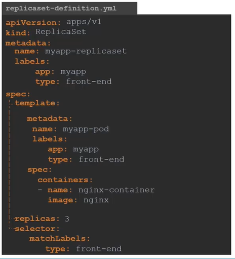
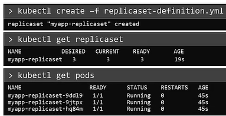

# ReplicaSets

#### Controllers kubernetes 的”大脑“

## Replica 是什么，为什么需要 replication controller?

  
  
  
  
## ReplicaSet 与 Replication Controller的区别
- **`Replication Controller`** 是老版本实现，已被 **`ReplicaSet`**所取代，.
- **`ReplicaSet`**  副本的 新版本实现.

## 创建ReplicaSet
  
## ReplicaSet 定义文件

   

```
    apiVersion: apps/v1
    kind: ReplicaSet
    metadata:
      name: myapp-replicaset
      labels:
        app: myapp
        type: front-end
    spec:
     template:
        metadata:
          name: myapp-pod
          labels:
            app: myapp
            type: front-end
        spec:
         containers:
         - name: nginx-container
           image: nginx
     replicas: 3
     selector:
       matchLabels:
        type: front-end
 ```
#### ReplicaSet 在使用时需要定义一个选择器
   
  - To Create the replicaset
    ```
    $ kubectl create -f replicaset-definition.yaml
    ```
  - To list all the replicaset
    ```
    $ kubectl get replicaset
    ```
  - To list pods that are launch by the replicaset
    ```
    $ kubectl get pods
    ```
   
    
    
## Labels and Selectors
#### What is the deal with Labels and Selectors? Why do we label pods and objects in kubernetes?

  
  
## 如何扩容
- 3种方法
  - 修改副本数
 ```
    apiVersion: apps/v1
    kind: ReplicaSet
    metadata:
      name: myapp-replicaset
      labels:
        app: myapp
        type: front-end
    spec:
     template:
        metadata:
          name: myapp-pod
          labels:
            app: myapp
            type: front-end
        spec:
         containers:
         - name: nginx-container
           image: nginx
     replicas: 6
     selector:
       matchLabels:
        type: front-end
```

  ```
  $ kubectl apply -f replicaset-definition.yaml
  ```
- 使用  **`kubectl scale`** 命令.
  ```
  $ kubectl scale --replicas=6 -f replicaset-definition.yaml
  ```
  ```
  $ kubectl scale --replicas=6 replicaset myapp-replicaset
  ```
