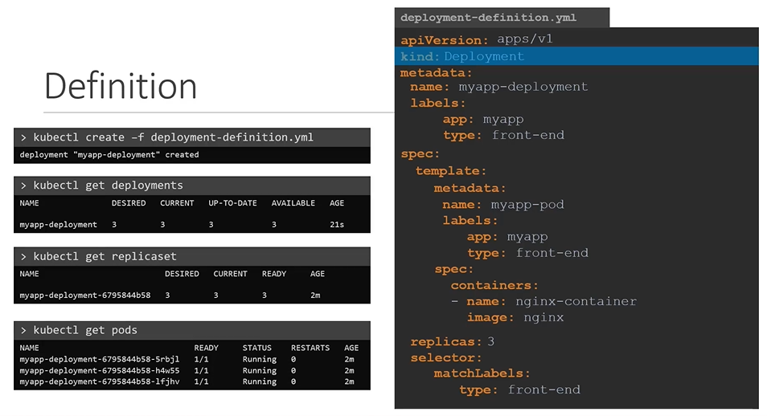
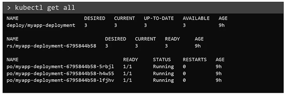

# Deployments
  
 
  
#### 如何创建 deployment?

```
    apiVersion: apps/v1
    kind: Deployment
    metadata:
      name: myapp-deployment
      labels:
        app: myapp
        type: front-end
    spec:
     template:
        metadata:
          name: myapp-pod
          labels:
            app: myapp
            type: front-end
        spec:
         containers:
         - name: nginx-container
           image: nginx
     replicas: 3
     selector:
       matchLabels:
        type: front-end
 ```
- 文件准备就绪，使用部署定义文件创建部署。
  ```
  $ kubectl create -f deployment-definition.yaml
  ```
- 查看 deployment
  ```
  $ kubectl get deployment
  ```
- deployment 会自动创建  **`ReplicaSet`**. 查看 replicasets
  ```
  $ kubectl get replicaset
  ```
- replicasets 最终会创建 **`PODs`**.查看 PODs
  ```
  $ kubectl get pods
  ```
    
  
  
- 全部查看命令
  ```
  $ kubectl get all
  ```
  
  