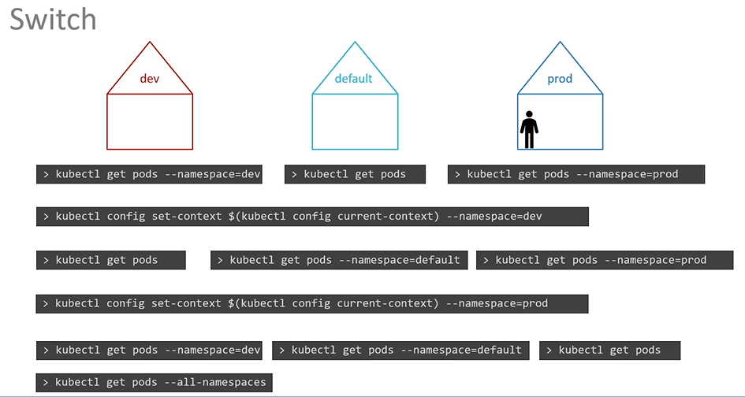

# Namespaces

  到目前为止，在这门课程中，我们已经在我们的集群中创建了**对象，如PODs、Deployments和Services。我们所做的一切都是在一个NAMESPACE**中进行的。


- 这个命名空间是 Kubernetes 中的**默认**命名空间。在 Kubernetes 初始设置时，它会自动创建。

  
 
- 你可以创建自己的命名空间

  
  
- 获得default命名空间下的pod
  ```
  $ kubectl get pods
  ```
- 要列出另一个命名空间中的 POD，可以使用**kubectl get pods命令和--namespace**标志或参数。
  ```
  $ kubectl get pods --namespace=kube-system
  ```
  
  
- 这里有一个 Pod 定义文件，当我们使用 Pod 定义文件创建一个 Pod 时，Pod 会在默认命名空间中创建

```
apiVersion: v1
kind: Pod
metadata:
  name: myapp-pod
  labels:
     app: myapp
     type: front-end
spec:
  containers:
  - name: nginx-container
    image: nginx
 ```
  ```
  $ kubectl create -f pod-definition.yaml
  ```
- To create the pod with the pod-definition file in another namespace, use the **`--namespace`** option.
  ```
  $ kubectl create -f pod-definition.yaml --namespace=dev
  ```
  

```
apiVersion: v1
kind: Pod
metadata:
  name: myapp-pod
  namespace: dev
  labels:
     app: myapp
     type: front-end
spec:
  containers:
  - name: nginx-container
    image: nginx
 ```
  
  

  ```
  $ kubectl create namespace dev
  ```
  
  
- 查看所有 namespaces 下的pod
  ```
  $ kubectl get pods --all-namespaces
  ```
  
  
- 为了限制命名空间中的资源，创建一个资源配额。要创建一个资源配额，请从 ResourceQuota 定义文件开始。
```
apiVersion: v1
kind: ResourceQuota
metadata:
  name: compute-quota
  namespace: dev
spec:
  hard:
    pods: "10"
    requests.cpu: "4"
    requests.memory: 5Gi
    limits.cpu: "10"
    limits.memory: 10Gi
```
  ```
  $ kubectl create -f compute-quota.yaml
  ```
  
  
  
