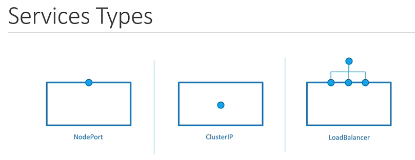
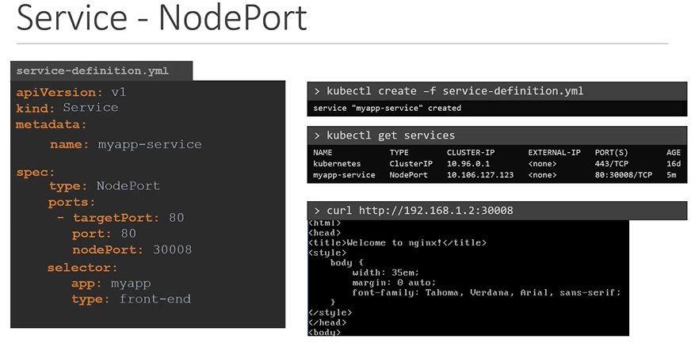
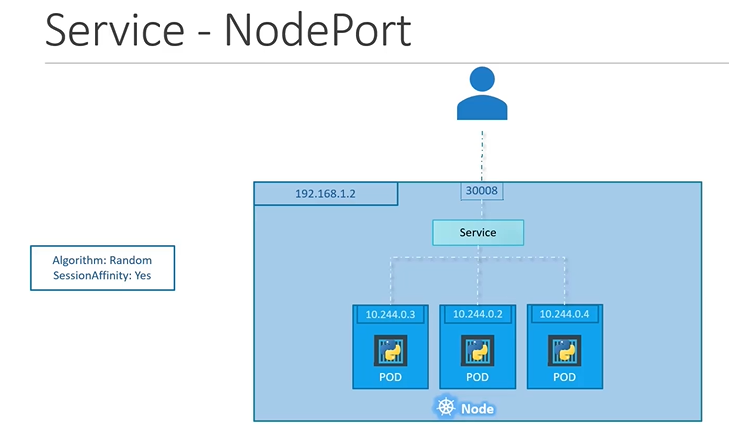

# Kubernetes Services

  
## Services
- Kubernetes 的Service 允许应用程序内部和外部的各个组件之间进行通信。

  
  


## External Communication

- 作为外部用户，我们如何访问此网页？?


  
    
    


  
    
   
    
 ## Service 类型
 
 #### kubernetes 中的三种网络类型
 
   
 
 1. NodePort
    - Where the service makes an internal POD accessible on a POD on the NODE.
      ```
      apiVersion: v1
      kind: Service
      metadata:
       name: myapp-service
      spec:
       types: NodePort
       ports:
       - targetPort: 80
         port: 80
         nodePort: 30008
      ```
     
      
      ####  service关联上 pod
      ```
      apiVersion: v1
      kind: Service
      metadata:
       name: myapp-service
      spec:
       type: NodePort
       ports:
       - targetPort: 80
         port: 80
         nodePort: 30008
       selector:
         app: myapp
         type: front-end
       ```

    
      
      #### To create the service
      ```
      $ kubectl create -f service-definition.yaml
      ```
      
      #### To list the services
      ```
      $ kubectl get services
      ```
      
      #### To access the application from CLI instead of web browser
      ```
      $ curl http://192.168.1.2:30008
      ```
      
      

      #### A service  多pods场景
      
      
      
      #### Pods 分布在集群的 nodes上
     
      
     
            
 2. ClusterIP
    - 在这种情况下，服务在集群内创建一个虚拟 IP（Virtual IP），以便不同服务之间进行通信，例如一组前端服务器与一组后端服务器之间的通信。
    
 3. LoadBalancer
    - 云服务提供商为我们的应用程序提供了一个负载均衡器（load balancer）。

