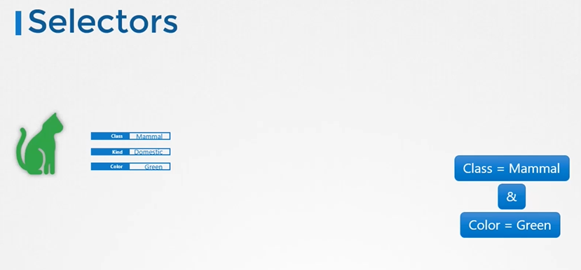
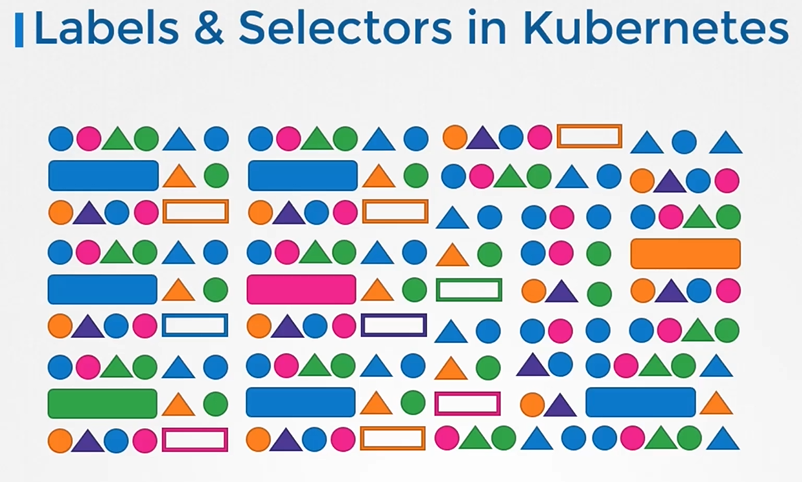
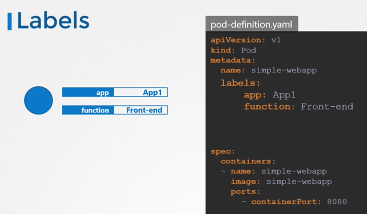
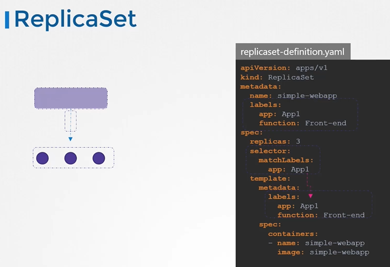
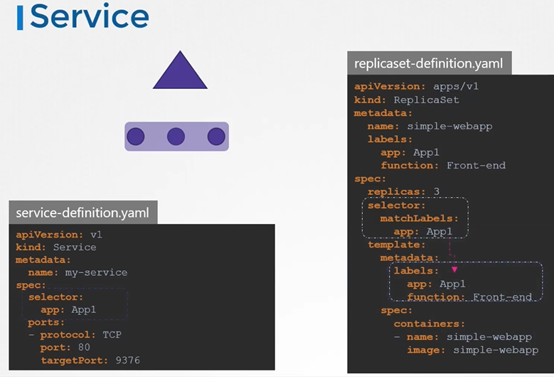

# Labels and Selectors

#### 标签和选择器是将事物分组的标准方法。
  
#### 标签是附加到每个项上的属性。

  
  
#### 选择器帮助您过滤这些项目。
 
  
  
kubernetes中label和selector用在了哪里?
-  我们在 Kubernetes 中创建了不同类型的对象，例如 PODs、ReplicaSets、Deployments 等等。
  
  
  
How do you specify labels?
   ```
    apiVersion: v1
    kind: Pod
    metadata:
     name: simple-webapp
     labels:
       app: App1
       function: Front-end
    spec:
     containers:
     - name: simple-webapp
       image: simple-webapp
       ports:
       - containerPort: 8080
   ```
 
 
一旦创建了 Pod，要选择具有标签的 Pod，请运行以下命令。
```
$ kubectl get pods --selector app=App1
```

Kubernetes uses labels to connect different objects together
   ```
    apiVersion: apps/v1
    kind: ReplicaSet
    metadata:
      name: simple-webapp
      labels:
        app: App1
        function: Front-end
    spec:
     replicas: 3
     selector:
       matchLabels:
        app: App1
    template:
      metadata:
        labels:
          app: App1
          function: Front-end
      spec:
        containers:
        - name: simple-webapp
          image: simple-webapp   
   ```

  

For services
 
      ```
      apiVersion: v1
      kind: Service
      metadata:
       name: my-service
      spec:
       selector:
         app: App1
       ports:
       - protocol: TCP
         port: 80
         targetPort: 9376 
       ```
  
  
## Annotations
- 虽然标签和选择器用于分组对象，但注释用于记录其他详细信息，以供信息用途。
    ```
    apiVersion: apps/v1
    kind: ReplicaSet
    metadata:
      name: simple-webapp
      labels:
        app: App1
        function: Front-end
      annotations:
         buildversion: 1.34
    spec:
     replicas: 3
     selector:
       matchLabels:
        app: App1
    template:
      metadata:
        labels:
          app: App1
          function: Front-end
      spec:
        containers:
        - name: simple-webapp
          image: simple-webapp   
    ```
  