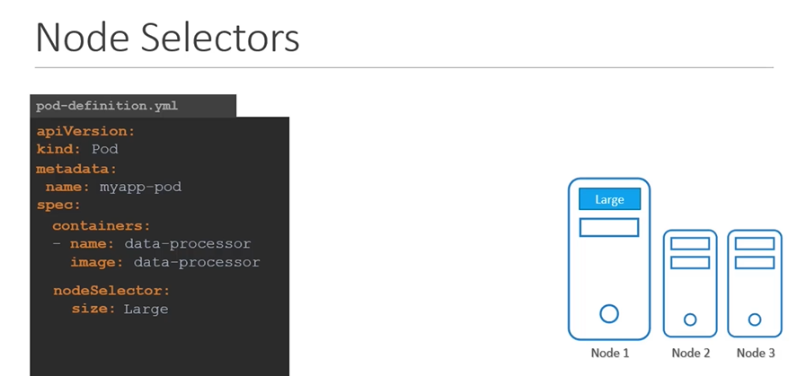

# Node Selectors

#### W我们在spec部分中添加了一个名为Node Selector的新属性，并指定了标签。


- 调度器使用这些标签来匹配和识别合适的节点，以放置Pod。
  ```
  apiVersion: v1
  kind: Pod
  metadata:
   name: myapp-pod
  spec:
   containers:
   - name: data-processor
     image: data-processor
   nodeSelector:
    size: Large
  ```

  
- 给节点打label
  ```
  $ kubectl label nodes <node-name> <label-key>=<label-value>
  ```
  Example
  ```
  $ kubectl label nodes node-1 size=Large
  ```
  

  
- To create a pod definition
  ```
  apiVersion: v1
  kind: Pod
  metadata:
   name: myapp-pod
  spec:
   containers:
   - name: data-processor
     image: data-processor
   nodeSelector:
    size: Large
  ```
  ```
  $ kubectl create -f pod-definition.yml
  ```
  

  
## Node Selector - Limitations
- 我们在这里使用了单个标签和选择器来实现我们的目标。但是，如果我们的要求更加复杂，该怎么办呢？
  

 
- 高级技巧： **`Node Affinity and Anti Affinity`**


