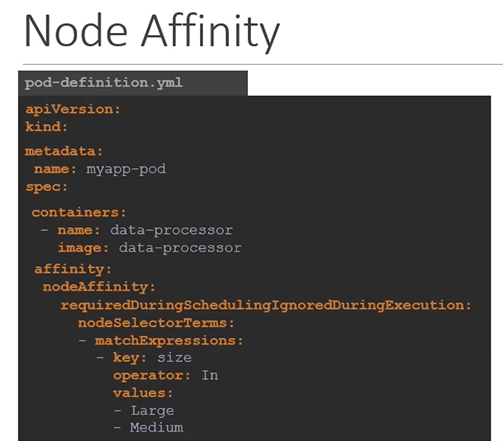
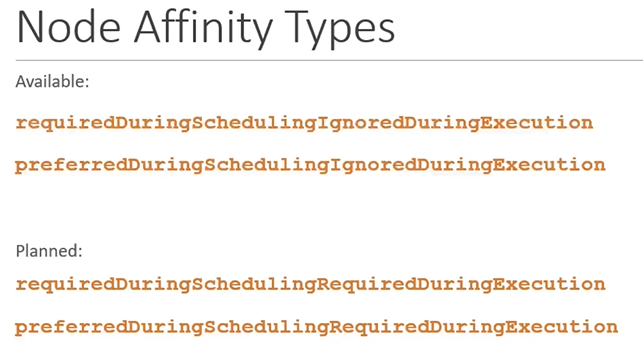
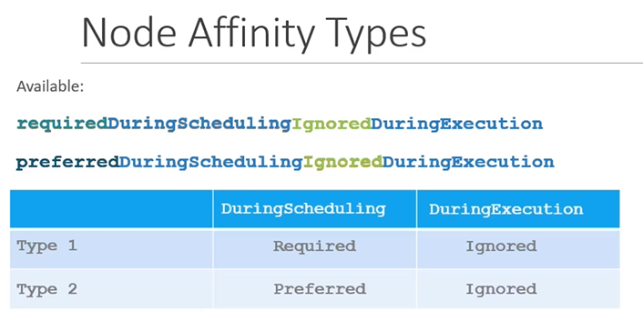
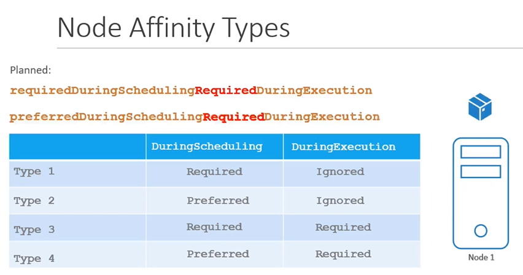

# Node 亲和性

#### 节点亲和性的主要特点是确保Pod在特定节点上部署。

- With **`Node Selectors`** we cannot provide the advance expressions.
  ```
  apiVersion: v1
  kind: Pod
  metadata:
   name: myapp-pod
  spec:
   containers:
   - name: data-processor
     image: data-processor
   nodeSelector:
    size: Large
  ```
  
  ```
  apiVersion: v1
  kind: Pod
  metadata:
   name: myapp-pod
  spec:
   containers:
   - name: data-processor
     image: data-processor
   affinity:
     nodeAffinity:
       requiredDuringSchedulingIgnoredDuringExecution:
          nodeSelectorTerms:
          - matchExpressions:
            - key: size
              operator: In
              values: 
              - Large
              - Medium
  ```
  
  
  ```
  apiVersion: v1
  kind: Pod
  metadata:
   name: myapp-pod
  spec:
   containers:
   - name: data-processor
     image: data-processor
   affinity:
     nodeAffinity:
       requiredDuringSchedulingIgnoredDuringExecution:
          nodeSelectorTerms:
          - matchExpressions:
            - key: size
              operator: NotIn
              values: 
              - Small
  ```
  
  
  ```
  apiVersion: v1
  kind: Pod
  metadata:
   name: myapp-pod
  spec:
   containers:
   - name: data-processor
     image: data-processor
   affinity:
     nodeAffinity:
       requiredDuringSchedulingIgnoredDuringExecution:
          nodeSelectorTerms:
          - matchExpressions:
            - key: size
              operator: Exists
  ```
  
  
  

## Node Affinity Types
- Available
  - requiredDuringSchedulingIgnoredDuringExecution
  - preferredDuringSchedulingIgnoredDuringExecution
  
  
  
## Node Affinity Types States

  
  
  
  