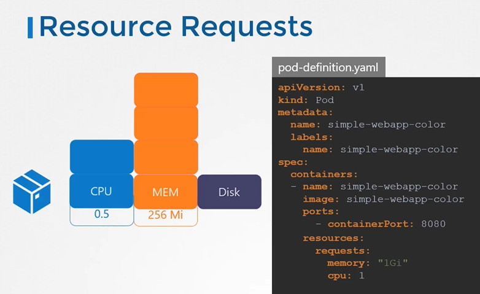

# Resource Limits


#### 让我们来看一个由3个节点组成的Kubernetes集群。

- 每个节点都有一组可用的CPU、内存和磁盘资源。
如果任何一个节点上没有足够的资源可用，Kubernetes会暂停Pod的调度。您将看到该Pod处于挂起状态。如果查看事件，您将看到原因是CPU不足。
  
  
  
## Resource Requirements
- 默认情况下，Kubernetes假定一个Pod或Pod中的容器需要**0.5** CPU和**256Mi内存。这被称为容器的资源请求（Resource Request）**。
  
  
  
- 如果Pod内的应用程序需要超过默认资源，您需要在Pod定义文件中设置它们。

  ```
  apiVersion: v1
  kind: Pod
  metadata:
    name: simple-webapp-color
    labels:
      name: simple-webapp-color
  spec:
   containers:
   - name: simple-webapp-color
     image: simple-webapp-color
     ports:
      - containerPort:  8080
     resources:
       requests:
        memory: "1Gi"
        cpu: "1"
  ```
   
   
## Resources - Limits
- 默认情况下，Kubernetes将资源限制设置为1个CPU和512Mi的内存。
  
  
  
- You can set the resource limits in the pod definition file.
  
  ```
  apiVersion: v1
  kind: Pod
  metadata:
    name: simple-webapp-color
    labels:
      name: simple-webapp-color
  spec:
   containers:
   - name: simple-webapp-color
     image: simple-webapp-color
     ports:
      - containerPort:  8080
     resources:
       requests:
        memory: "1Gi"
        cpu: "1"
       limits:
         memory: "2Gi"
         cpu: "2"
  ```
  
  
####注意：请记住，资源的请求和限制是针对Pod中每个容器设置的。
