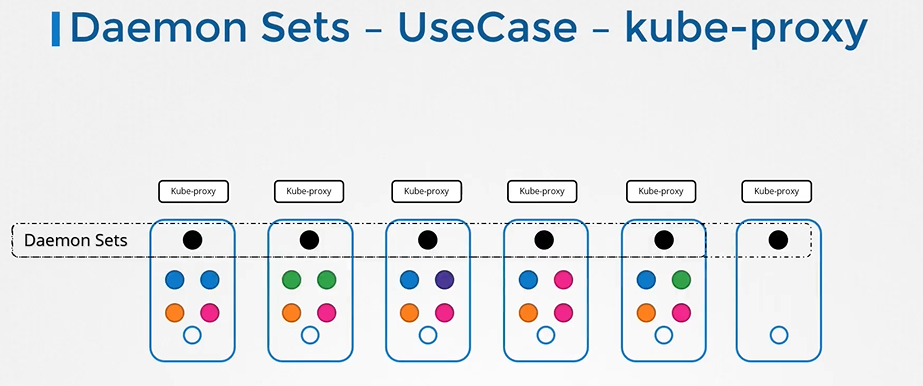
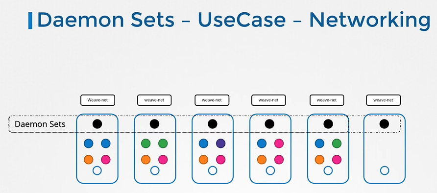
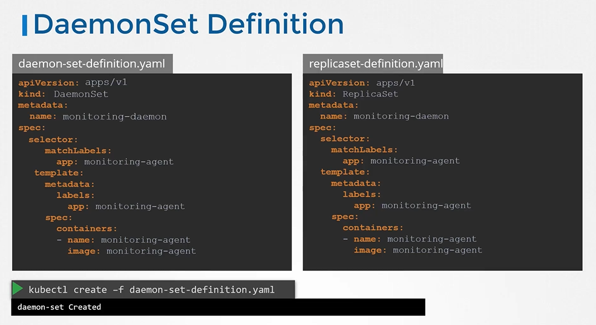

# DaemonSets


#### DaemonSet就像ReplicaSet一样，它有助于部署多个Pod实例。但它会在集群中的每个节点上运行一个Pod副本。
  
  
  
## DaemonSets - UseCases

  
  
  
  
  
  
## DaemonSets - 定义文件

  ```
  apiVersion: apps/v1
  kind: Replicaset
  metadata:
    name: monitoring-daemon
    labels:
      app: nginx
  spec:
    selector:
      matchLabels:
        app: monitoring-agent
    template:
      metadata:
       labels:
         app: monitoring-agent
      spec:
        containers:
        - name: monitoring-agent
          image: monitoring-agent
  ```
  
  ```
  apiVersion: apps/v1
  kind: DaemonSet
  metadata:
    name: monitoring-daemon
    labels:
      app: nginx
  spec:
    selector:
      matchLabels:
        app: monitoring-agent
    template:
      metadata:
       labels:
         app: monitoring-agent
      spec:
        containers:
        - name: monitoring-agent
          image: monitoring-agent
  ```
  
  
- To create a daemonset from a definition file
  ```
  $ kubectl create -f daemon-set-definition.yaml
  ```

## 查看 DaemonSets
- To list daemonsets
  ```
  $ kubectl get daemonsets
  ```
- For more details of the daemonsets
  ```
  $ kubectl describe daemonsets monitoring-daemon
  ```
  
  
## DaemonSets 实现原理

  

