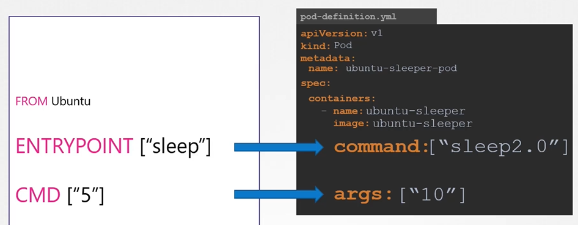

#  Kubernetes 设置 启动命令 和 启动参数

  ```
  apiVersion: v1
  kind: Pod
  metadata:
    name: ubuntu-sleeper-pod
  spec:
   containers:
   - name: ubuntu-sleeper
     image: ubuntu-sleeper
     command: ["sleep2.0"]
     args: ["10"]
  ```
  
  