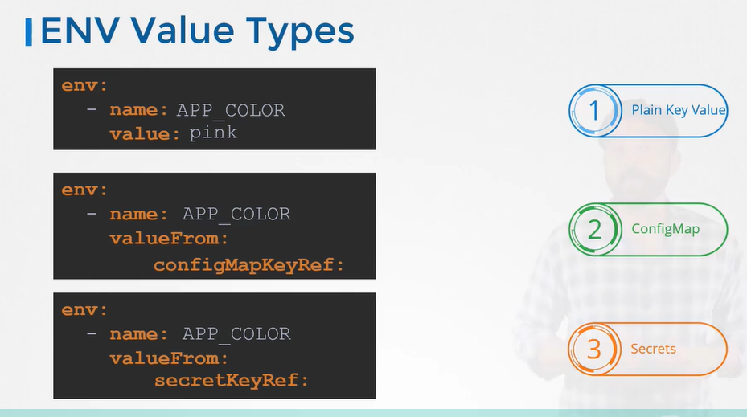

# 环境变量
#### ENV variables in kubernetes 
- To set an environment variable set an **`env`** property in pod definition file.
  
  ```
  apiVersion: v1
  kind: Pod
  metadata:
    name: simple-webapp-color
  spec:
   containers:
   - name: simple-webapp-color
     image: simple-webapp-color
     ports:
     - containerPort: 8080
     env:
     - name: APP_COLOR
       value: pink
  ```
  
  
- 还有其他设置环境变量的方式，例如**ConfigMaps和Secrets**。

  

