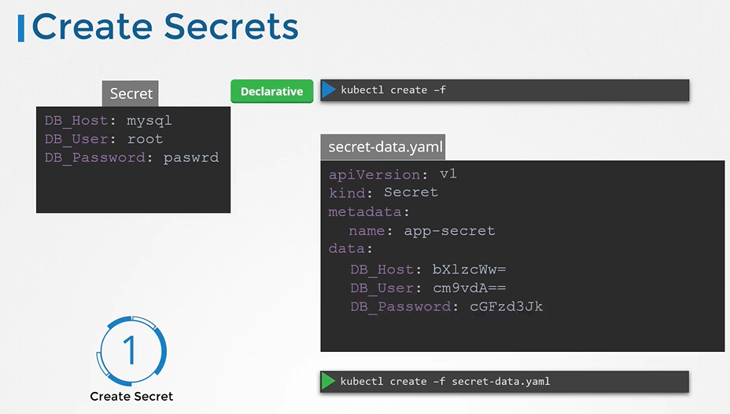
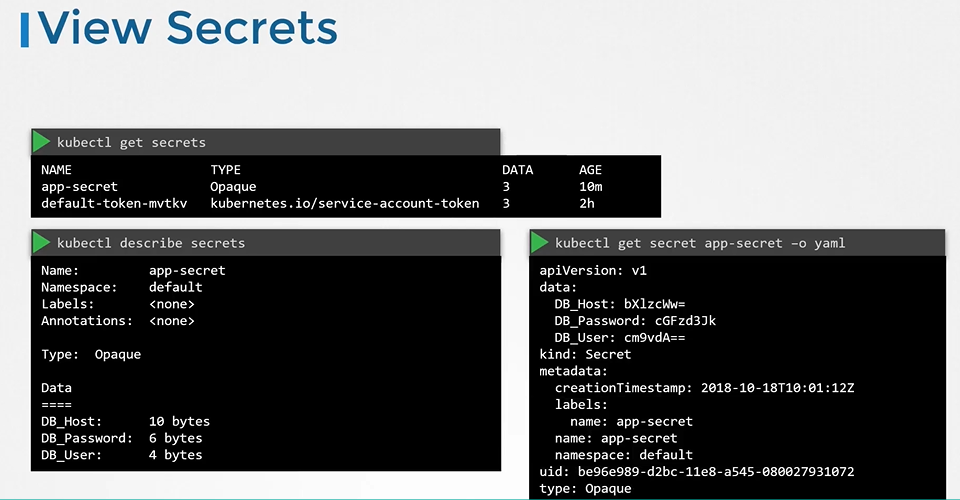
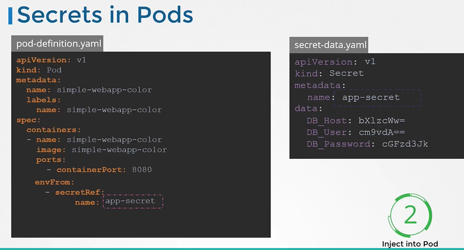

# Secrets


#### There are 2 steps involved with secrets
- First, Create a secret
- Second, Inject the secret into a pod.
  
  
  
#### 创建secret的方法


  - The Declarative way
  ```
  生成密码的哈希值，并将其传递给secret-data.yaml定义值作为DB_Password变量的值。
  $ echo -n "mysql" | base64
  $ echo -n "root" | base64
  $ echo -n "paswrd"| base64
  ```
  
创建一个密钥定义文件，然后运行 kubectl create 来部署它。

  ```
  apiVersion: v1
  kind: Secret
  metadata:
   name: app-secret
  data:
    DB_Host: bX1zcWw=
    DB_User: cm9vdA==
    DB_Password: cGFzd3Jk
  ```
  ```
  $ kubectl create -f secret-data.yaml
  ```

  
  
## 编码 Secrets

  
  
## View Secrets
- To view secrets
  ```
  $ kubectl get secrets
  ```
- To describe secret
  ```
  $ kubectl describe secret
  ```
- To view the values of the secret
  ```
  $ kubectl get secret app-secret -o yaml
  ```
  
  
  
## 解码 Secrets
- To decode secrets
  ```
  $ echo -n "bX1zcWw=" | base64 --decode
  $ echo -n "cm9vdA==" | base64 --decode
  $ echo -n "cGFzd3Jk" | base64 --decode
  ```
  
  
## Pod中注入secret
- 要将一个密钥注入到Pod中，添加一个新的属性**envFrom，后跟secretRef**名称，然后创建Pod定义。
  
  ```
  apiVersion: v1
  kind: Secret
  metadata:
   name: app-secret
  data:
    DB_Host: bX1zcWw=
    DB_User: cm9vdA==
    DB_Password: cGFzd3Jk
  ```
  ```
   apiVersion: v1
   kind: Pod
   metadata:
     name: simple-webapp-color
   spec:
    containers:
    - name: simple-webapp-color
      image: simple-webapp-color
      ports:
      - containerPort: 8080
      envFrom:
      - secretRef:
          name: app-secret
   ```
  ```
  $ kubectl create -f pod-definition.yaml
  ```
  
