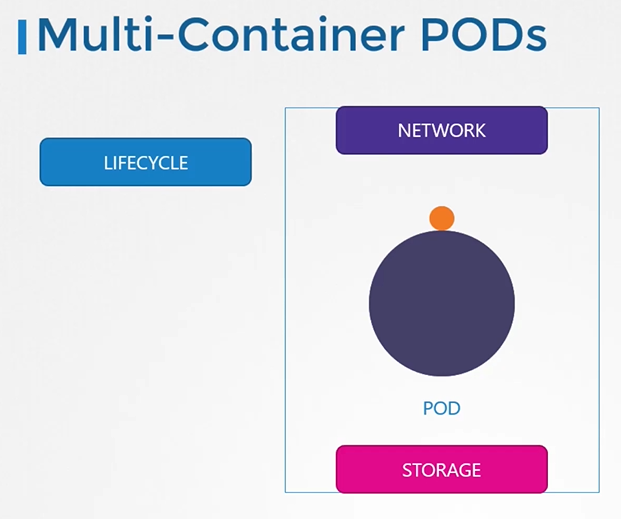

# Multi-Container Pods

## Monolith and Microservices

  
  
#### Multi-Container Pods

  
  
- 要创建一个新的多容器Pod，请将新容器的信息添加到Pod定义文件中。
  ```
  apiVersion: v1
  kind: Pod
  metadata:
    name: simple-webapp
    labels:
      name: simple-webapp
  spec:
    containers:
    - name: simple-webapp
      image: simple-webapp
      ports:
      - ContainerPort: 8080
    - name: log-agent
      image: log-agent
  ```
  
 