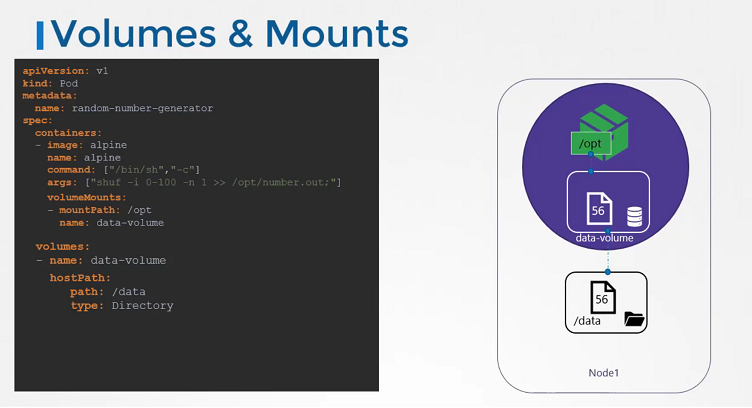

# Volumes

 **Volumes**

- 容器处理的数据现在放置在Volumes中，因此将其永久保留。即使删除容器，数据仍然保留在卷中.

- 在Kubernetes世界中，创建的POD是短暂的。当创建一个POD来处理数据，然后删除它时，它处理的数据也会被删除。 
- 例如，我们创建了一个简单的POD，在1到100之间生成一个随机数，并将其写入到/opt/number.out文件中。为了将其持久化到卷中.
- 我们为此创建一个卷。在这种情况下，我在主机上指定了一个路径/data。文件存储在我的节点上的data目录中。我们在每个容器中使用volumeMounts字段将数据卷挂载到容器内的目录/opt中。随机数现在将被写入容器内的/opt挂载点，这恰好在数据卷上，实际上是主机上的/data目录。当Pod被删除时，带有随机数的文件仍然存在于主机上。




## Volume 存储选项

- 在卷中，hostPath卷类型在单节点上是可以使用的。不建议在多节点集群中使用。
- 在Kubernetes中，支持几种标准存储解决方案，例如NFS、GlusterFS、CephFS或公共云解决方案，例如AWS EBS、Azure Disk或Google的Persistent Disk。


```
volumes:
- name: data-volume
  awsElasticBlockStore:
    volumeID: <volume-id>
    fsType: ext4
```