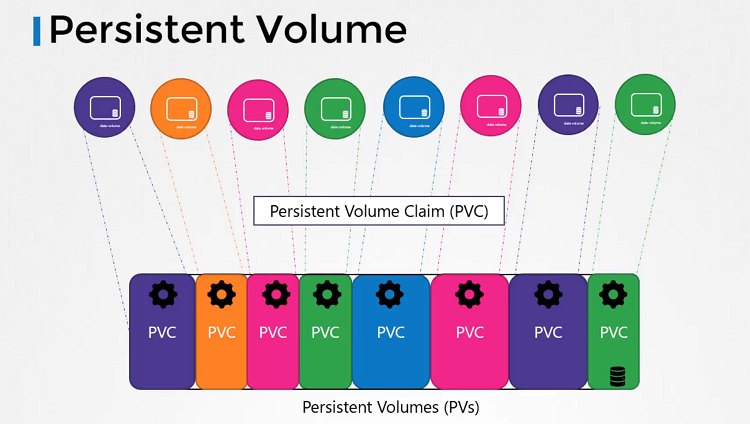

# Persistent Volumes


**Persistent Volumes**





- Persistent Volume是由管理员配置的集群范围的存储卷池，供在集群上部署应用程序的用户使用。现在，用户可以使用Persistent Volume Claims从该池中选择存储。

  ```
  pv-definition.yaml
  
  kind: PersistentVolume
  apiVersion: v1
  metadata:
    name: pv-vol1
  spec:
    accessModes: [ "ReadWriteOnce" ]
    capacity:
     storage: 1Gi
    hostPath:
     path: /tmp/data
  ```

  ```
  $ kubectl create -f pv-definition.yaml
  persistentvolume/pv-vol1 created

  $ kubectl get pv
  NAME      CAPACITY   ACCESS MODES   RECLAIM POLICY   STATUS      CLAIM   STORAGECLASS   REASON   AGE
  pv-vol1   1Gi        RWO            Retain           Available                                   3min
  
  $ kubectl delete pv pv-vol1
  persistentvolume "pv-vol1" deleted
  ```


