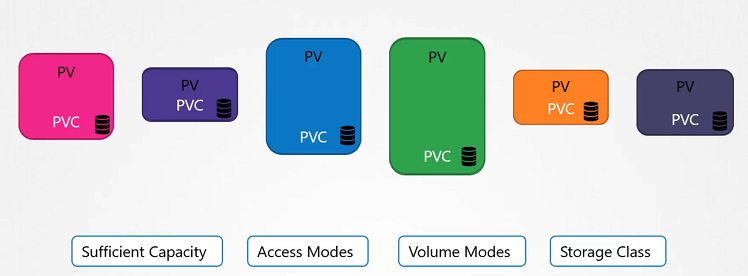

# Persistent Volume Claims


In this section, we will take a look at **Persistent Volume Claim**

- 现在，我们将创建一个Persistent Volume Claim，使存储可用于节点。
- 在Kubernetes命名空间中，pv和Persistent Volume Claim是两个独立的对象。
- 创建Persistent Volume Claim后，Kubernetes会根据请求和卷上设置的属性将Persistent Volume绑定到pvc中。




- 如果属性不匹配或Persistent Volume对于Persistent Volume Claim不可用，则它将显示处于挂起状态。

```
pvc-definition.yaml

kind: PersistentVolumeClaim
apiVersion: v1
metadata:
  name: myclaim
spec:
  accessModes: [ "ReadWriteOnce" ]
  resources:
   requests:
     storage: 1Gi
```

```
pv-definition.yaml

kind: PersistentVolume
apiVersion: v1
metadata:
    name: pv-vol1
spec:
    accessModes: [ "ReadWriteOnce" ]
    capacity:
     storage: 1Gi
    hostPath:
     path: /tmp/data
```

#### 创建 Persistent Volume

```
$ kubectl create -f pv-definition.yaml
persistentvolume/pv-vol1 created

$ kubectl get pv
NAME      CAPACITY   ACCESS MODES   RECLAIM POLICY   STATUS      CLAIM   STORAGECLASS   REASON   AGE
pv-vol1   1Gi        RWO            Retain           Available                                   10s
```


#### 创建 Persistent Volume Claim

```
$ kubectl create -f pvc-definition.yaml
persistentvolumeclaim/myclaim created

$ kubectl get pvc
NAME      STATUS    VOLUME   CAPACITY   ACCESS MODES   STORAGECLASS   AGE
myclaim   Pending                                                     35s

$ kubectl get pvc
NAME      STATUS   VOLUME    CAPACITY   ACCESS MODES   STORAGECLASS   AGE
myclaim   Bound    pv-vol1   1Gi        RWO                           1min

```

#### 删除Persistent Volume Claim

```
$ kubectl delete pvc myclaim
```

#### 删除 Persistent Volume

```
$ kubectl delete pv pv-vol1
```
