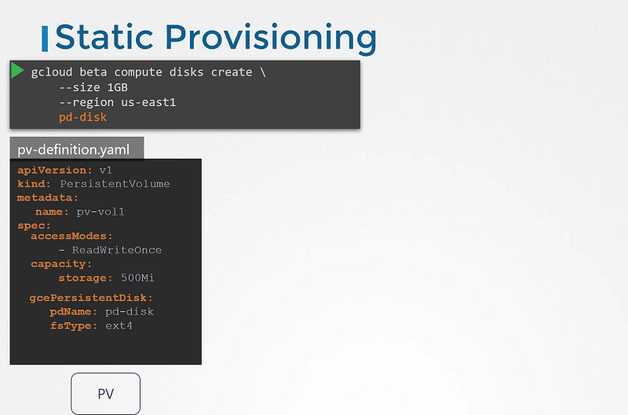

# Storage Class

 **Storage Class**

- 我们讨论了如何创建持久化卷（Persistent Volume）和持久化卷声明（Persistent Volume Claim），并且还看到了如何在Pod的卷中使用它来声明该卷的存储空间。
- 我们创建了持久化卷，但在此之前，如果我们要从云提供商（例如GCP、AWS、Azure）获取卷，我们需要首先在Google Cloud中创建磁盘（作为示例）。
- 我们每次在Pod定义文件中定义时都需要手动创建，这被称为静态预配（Static Provisioning）。

#### 静态 Provisioning




#### 动态 Provisioning


- 现在我们有了一个存储类（Storage Class），因此不再需要定义持久卷（Persistent Volume）。当创建存储类时，它将自动创建。这被称为“动态”。Provisioning**. 


#### 查询 Storage Class

```
$ kubectl get sc
NAME             PROVISIONER            RECLAIMPOLICY   VOLUMEBINDINGMODE   ALLOWVOLUMEEXPANSION   AGE
google-storage   kubernetes.io/gce-pd   Delete          Immediate           false                  20s
```
