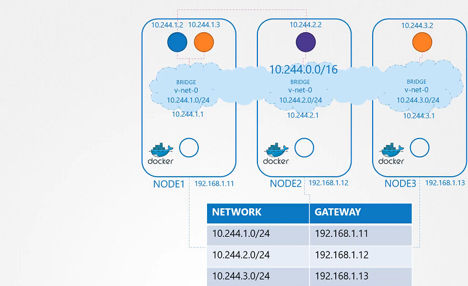

# Pod Networking

 **Pod Networking**

以下命令是 不借助k8s的网络组件 创建一个简单的Pod网络的解决方案
- 某个节点都创建一个Pod的虚拟网络
- 某个节点都配置到其他节点中的虚拟网络的路由表

> node01
```
$ ip link add v-net-0 type bridge
```
> node02
```
$ ip link add v-net-0 type bridge
```

> node03
```
$ ip link add v-net-0 type bridge
```

- Currently it's down, turn it up.

> node01
```
$ ip link set dev v-net-0 up
```

> node02
```
$ ip link set dev v-net-0 up
```

> node03
```
$ ip link set dev v-net-0 up
```

- Set the IP Addr for the bridge interface

> node01
```
$ ip addr add 10.244.1.1/24 dev v-net-0
```

> node02
```
$ ip addr add 10.244.2.1/24 dev v-net-0
```

> node03
```
$ ip addr add 10.244.3.1/24 dev v-net-0
```


- Check the reachability 

```
$ ping 10.244.2.2
Connect: Network is unreachable
```

- Add route in the routing table
```
$ ip route add 10.244.2.2 via 192.168.1.12
```

> node01
```
$ ip route add 10.244.2.2 via 192.168.1.12

$ ip route add 10.244.3.2 via 192.168.1.13
```

> node02
```
$ ip route add 10.244.1.2 via 192.168.1.11

$ ip route add 10.244.3.2 via 192.168.1.13

```

> node03
```
$ ip route add 10.244.1.2 via 192.168.1.11

$ ip route add 10.244.2.2 via 192.168.1.12
```

- Add a single large network 




## Container Network Interface,k8s的pod网络创建接口


