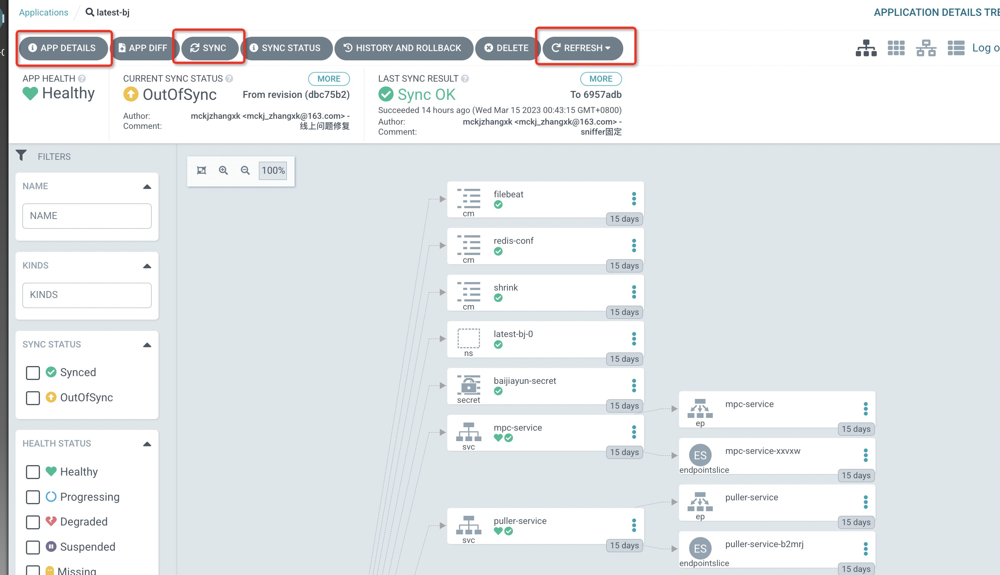

[部署地址](https://10.16.30.65:30304/),admin/hV-fHYIUlGcdolmc
[安装脚本](./argo_install.yaml)
Argo CD 是一个基于 GitOps 的持续交付工具，可以用于部署和管理 Kubernetes 应用程序。下面是使用 Argo CD 部署项目的一般步骤：

*  配置 GitOps 存储库：将应用程序的 YAML 文件存储在 Git 存储库中，使用 GitOps 模式管理部署和配置更新。在 Git 存储库中，您需要创建一个 Argo CD 应用程序清单，指定部署的应用程序和所需的 Kubernetes 资源。
*  部署应用程序：使用 Argo CD 的 Web UI 或 CLI 工具将应用程序部署到 Kubernetes 集群中。Argo CD 将自动拉取 Git 存储库中的 YAML 文件，并将其部署到集群中。
*  管理应用程序：使用 Argo CD 的 Web UI 或 CLI 工具管理部署的应用程序，例如更新应用程序的配置、部署新版本、回滚到以前的版本等。

