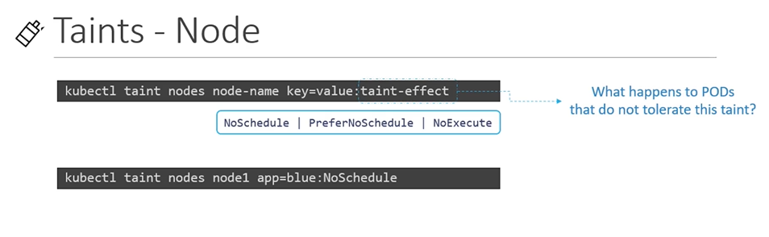
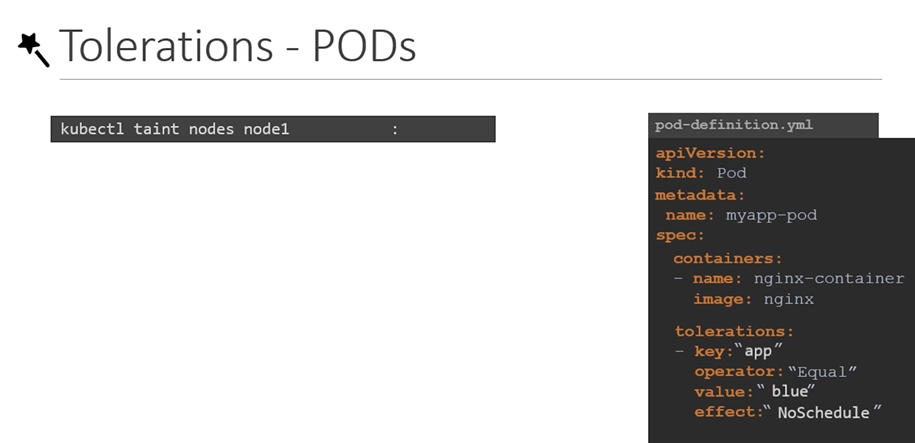

# Taints and Tolerations
  - Take me to [Video Tutorial](https://kodekloud.com/topic/taints-and-tolerations-2/)
  
In this section, we will take a look at taints and tolerations.
- Pod to node relationship and how you can restrict what pods are placed on what nodes.

#### Taints and Tolerations are used to set restrictions on what pods can be scheduled on a node. 
- Only pods which are tolerant to the particular taint on a node will get scheduled on that node.

  
  
  - 污点是kv对，是对node的染色，被标记污点的Node上不会被 部署pod
  - 除非 pod 免疫 这个污点
## Taints
- Use **`kubectl taint nodes`** command to taint a node.

  Syntax
  ```
  $ kubectl taint nodes <node-name> key=value:taint-effect
  ```
 
  Example
  ```
  $ kubectl taint nodes node1 app=blue:NoSchedule
  ```
  
- The taint effect defines what would happen to the pods if they do not tolerate the taint.
- There are 3 taint effects
  - **`NoSchedule`**
  - **`PreferNoSchedule`**
  - **`NoExecute`**
  
  
  
## Tolerations
   - Tolerations are added to pods by adding a **`tolerations`** section in pod definition.
     ```
     apiVersion: v1
     kind: Pod
     metadata:
      name: myapp-pod
     spec:
      containers:
      - name: nginx-container
        image: nginx
      tolerations:
      - key: "app"
        operator: "Equal"
        value: "blue"
        effect: "NoSchedule"
     ```
    
  
    

