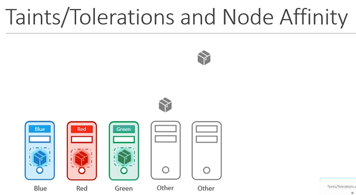

# Taints and Tolerations vs Node Affinity


  
  
- Taints 就是 kv对
- 对node 打 Taints, 所有机器都不会被部署服务，除非-
- 对Pod 打Tolerations, 免疫污点
- **守护进程免疫所有污点**

  

```yaml
spec:
  replicas: 1
  selector:
    matchLabels:
      app: msms-pod
  template:
    metadata:
      name: msms
      creationTimestamp: null
      labels:
        app: msms-pod
    spec:
      containers:
        - name: msms
          image: >-
            registry.cn-beijing.aliyuncs.com/webrtc-boom/msms:rtcs-v0.0.18-newms2-prod
      tolerations:  #msms可以部署在有如下标记的  机器上
        - key: app
          operator: Equal
          value: msms
          effect: NoExecute
      nodeSelector:   #msms只会部署到 有以下label的机器上
        env: test-latest
        region: sh
```