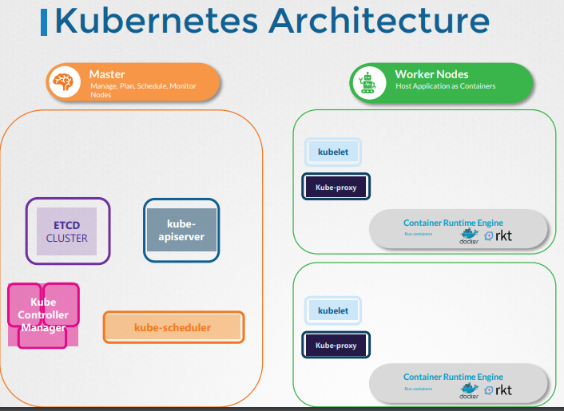

### 中心服务
##### Controller Manager

Control Manager确保了k8s的整个生命周期中，各种资源对象的状态符合预期，以达到集群中容器的自动化调度和管理。

* 管理pod的: Replicaset Controller
* 管理node的: Node Controller
* CSR-APPROVING: 批准用户的签名的 Controller
* CSR-signing: 签名 csr的 Controller

##### Schedular

 负责将Pod调度到合适的节点上以运行。
 * Pod的资源需求和节点的资源使用情况进行节点选择。
 * 容错处理: 如果Scheduler无法为Pod找到合适的节点，加入到等待队列。

 ##### Api Server
RestAPI,提供给外部访问k8s的所需接口，是k8s系统中所有资源对象的唯一入口。

### 工作节点服务
#### Kubelet
负责管理节点上的Pod并与Kubernetes Master协同工作。
* Pod生命周期管理（创建，销毁，重启。。。）
* 资源管理: 工作节点上的CPU、内存、磁盘资源的管理。
* Pod 网络创建,通过与CNI（Container Network Interface）插件进行交互。
* 与Kubernetes Master的通信。
#### KubeProxy
kube-proxy是每个节点上的网络代理组件，负责为集群中的Service对象提供负载均衡和服务发现功能。

* Service代理和负载均衡：通过在节点上设置iptables规则或IPVS规则，为Service对象提供代理和负载均衡功能。
* Endpoint发现：kube-proxy会监听Kubernetes API Server上Endpoint对象的变化，通过获得Endpoint对象的podip与端口号，与service绑定起来。

