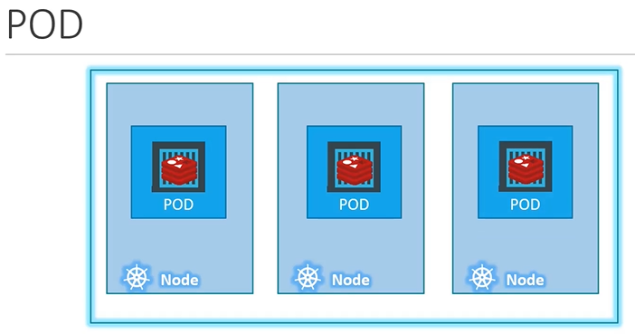

# Pods

#### pod,node,container直接的关系
  
## Multi-Container PODs
  
- node是物理机
- pod是部署在node上的虚拟机，有ip
- container是应用， 运行在虚拟机pod上，一个pod上可以有多个container。

pod特性：
- pod内的 container共享 pod的volume
- pod内的 container共享 pod的网络
- pod 会被随机调度到node 【在不配置调度策略下】
- container应用down 会被 pod拉起
- pod 宕机 会被k8s拉起（replicaset）

#### Pod will have a one-to-one relationship with containers running your application.

## pod的调度
  
  

