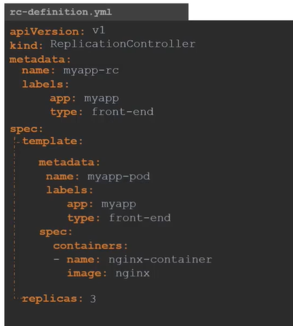
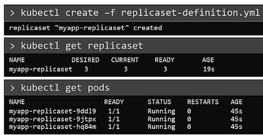

# ReplicaSets


- Replication Controller
- ReplicaSet

#### Controllers are brain behind kubernetes

## What is a Replica and Why do we need a replication controller?

  
  
  
  

## Replication Controller Definition File
  
   
  
```yaml
    apiVersion: v1
    kind: ReplicationSet
    metadata:
      name: redis
    spec:
     template:
        metadata:
          name: redis-pod
          labels:
            app: redis
        spec:
         containers:
         - name: redis
           image: redis:latest
     replicas: 3
     selector:
       matchLabels:
         app: redis
```

#### 命令
   
  - To Create the replicaset
    ```
    $ kubectl create -f replicaset-definition.yaml
    ```
  - To list all the replicaset
    ```
    $ kubectl get replicaset
    ```
  - To list pods that are launch by the replicaset
    ```
    $ kubectl get pods
    ```
   
    
