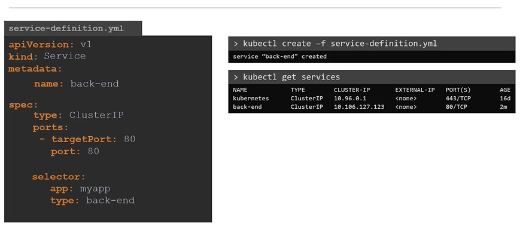

# Kubernetes Services


## Services
- Kubernetes Services enables communication between various components within and outside of the application.

  
  
#### Let's look at some other aspects of networking
 ## Service Types
 
 #### There are 3 types of service types in kubernetes
 
   


```
kubectl get svc -n test-sh mpc-service

//LoadBalancer
curl http://10.16.31.250:8081/health

//NodePort
curl http://10.16.31.249:39811/health
curl http://10.16.31.250:39811/health
curl http://10.16.31.251:39811/health
curl http://10.16.31.252:39811/health
curl http://10.16.31.253:39811/health
```

## External Communication
- 任意nodeip +nodeport
- LoadBalancer Ip+ servicePort
- How do we as an **`external user`** access the **`web page`**?

  - From the node (Able to reach the application as expected)
  
    
    
  - From outside world (This should be our expectation, without something in the middle it will not reach the application)
  
    


## Service Port
- In this case the service creates a **`Virtual IP`** inside the cluster to enable communication between different services such as a set of frontend servers to a set of backend servers.
    
    
    
#### What is a right way to establish connectivity between these services or tiers  
- A kubernetes service can help us group the pods together and provide a single interface to access the pod in a group.

  
  
#### To create a service of type ClusterIP
```
apiVersion: v1
kind: Service
metadata:
  name: redis-service
spec:
  type: ClusterIp
  ports:
  - port: 6379
    targetPort: 6379
    protocol: TCP
  selector:
    app: redis

---
apiVersion: v1
kind: Service
metadata:
  name: redis-service
spec:
  type: NodePort
  ports:
  - port: 6379
    targetPort: 6379
    protocol: TCP
    nodePort: 3xxxx
  selector:
    app: redis

---
apiVersion: v1
kind: Service
metadata:
  name: redis-service
spec:
  type: LoadBalancer
  ports:
  - port: 6379
    targetPort: 6379
    protocol: TCP
    nodePort: 3xxxx
  selector:
    app: redis
```
```
$ kubectl create -f service-definition.yaml
```

#### To list the services
```
$ kubectl get services
```
  