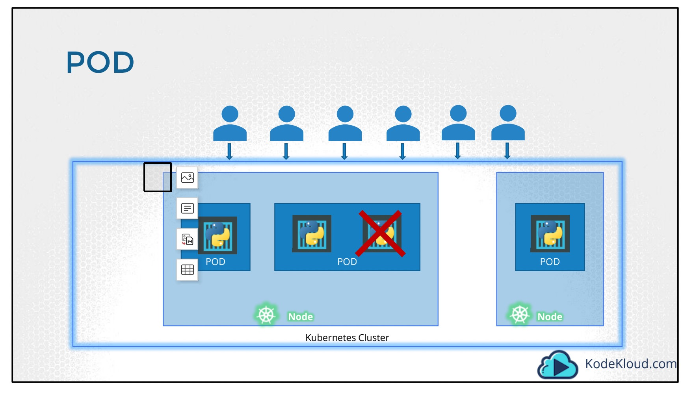
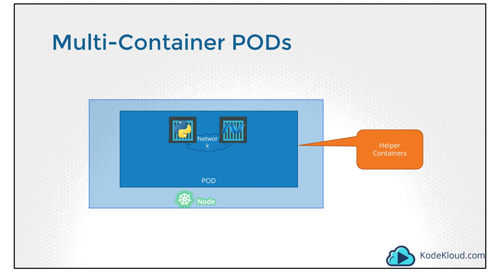

P39

single-container pod

```yaml
apiVersion: v1
kind: Pod
metadata:
  name: nginx-foo
  labels:
    app: nginx-foo
spec:
  containers:
    - name: nginx
      image: nginx
```



multi-container pod
```yaml
apiVersion: v1
kind: Pod
metadata:
  name: nginx-redis-foo
  labels:
    app:  nginx-redis-foo
spec:
  containers:
    - name: nginx
      image: nginx
    - name: redis
      image: redis
```