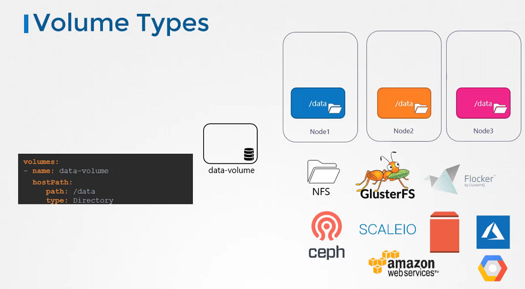

# Persistent Volumes


In this section, we will take a look at **Persistent Volumes**

- In the large evnironment, with a lot of users deploying a lot of pods, the users would have to configure storage every time for each Pod.
- Whatever storage solution is used, the users who deploys the pods would have to configure that on all pod definition files in his environment. Every time a change is to be made, the user would have to make them on all of his pods.


-  cluster-wide pool 
-  users can now select storage from this pool using Persistent Volume Claims.


  ```
  $ kubectl get pv|grep mongo-volume
  $ kubectl get pvc -n test-center|grep "mongo-volume-"
  ```


## Volume Storage Options

- In the volumes, hostPath volume type is fine with the single node. It's not recomended for use with the multi node cluster.
- In the Kubernetes, it supports several types of standard storage solutions such as NFS, GlusterFS, CephFS or public cloud solutions like AWS EBS, Azure Disk or Google's Persistent Disk.




mcu.yaml
```yaml
      volumes:
        - name: pvc-record-vol
          persistentVolumeClaim:
            claimName: pvc-record
      containers:
        - name: worker
          image: 'registry.cn-beijing.aliyuncs.com/webrtc-mcu/mcu:20230207'
          env:
            - name: POD_IP
              valueFrom:
                fieldRef:
                  apiVersion: v1
                  fieldPath: status.podIP
          resources: {}
          volumeMounts:
            - name: pvc-record-vol
              mountPath: /record
```
cloudrecordproc.yaml
```yaml
      volumes:
        - name: pv-record-vol
          persistentVolumeClaim:
            claimName: pvc-record
      containers:
        - name: cloudproc
          image: 'registry.cn-beijing.aliyuncs.com/webrtc-mcu/cloudrecordproc:20230207'
          volumeMounts:
            - name: config-vol
              mountPath: /app/cloudrecordproc/config
            - name: pv-record-vol
              mountPath: /nas/record
```