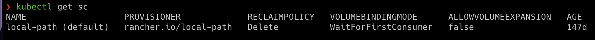
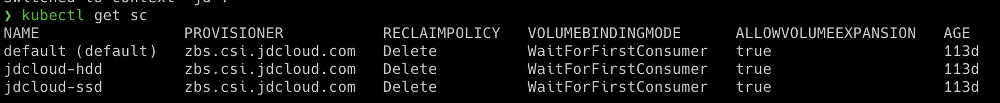

# Storage Class

#### Static Provisioning


#### Dynamic Provisioning


- No we have a Storage Class, So we no longer to define Persistent Volume. It will create automatically when a Storage Class is created. It's called **Dynamic Provisioning**. 

```
sc-definition.yaml

apiVersion: storage.k8s.io/v1
kind: StorageClass
metadata:
   name: google-storage
provisioner: kubernetes.io/gce-pd
```


