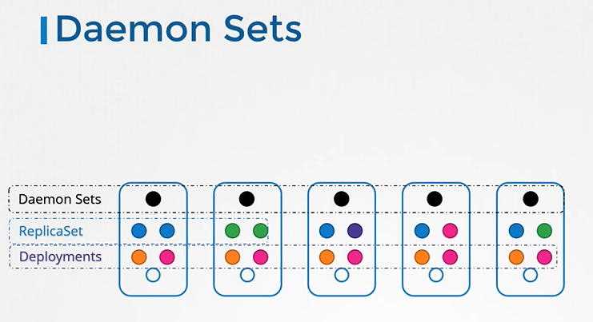

# DaemonSets
  - Take me to [Video Tutorial](https://kodekloud.com/topic/daemonsets/)

In this section, we will take a look at DaemonSets.

#### DaemonSets are like replicasets, as it helps in to deploy multiple instances of pod. But it runs one copy of your pod on each node in your cluster.
  
  
  
## DaemonSets - UseCases

* node-exporter
* kube-proxy
* calico-node
* msms
  
## DaemonSets - Definition
- Creating a DaemonSet is similar to the ReplicaSet creation process.
  
  
- To create a daemonset from a definition file
  ```
  $ kubectl create -f daemon-set-definition.yaml
  ```

## View DaemonSets
- To list daemonsets
  ```
  $ kubectl get daemonsets
  ```
- For more details of the daemonsets
  ```
  $ kubectl describe daemonsets monitoring-daemon
  ```
  
  
## How DaemonSets Works

  

```yaml
spec:
  affinity:
    nodeAffinity:
      requiredDuringSchedulingIgnoredDuringExecution:
        nodeSelectorTerms:
        - matchFields:
          - key: metadata.name
            operator: In
            values:
            - bjy-idc-brtc-laliu-test0203
  nodeName: bjy-idc-brtc-laliu-test0203
  nodeSelector:
    kubernetes.io/os: linux
```
