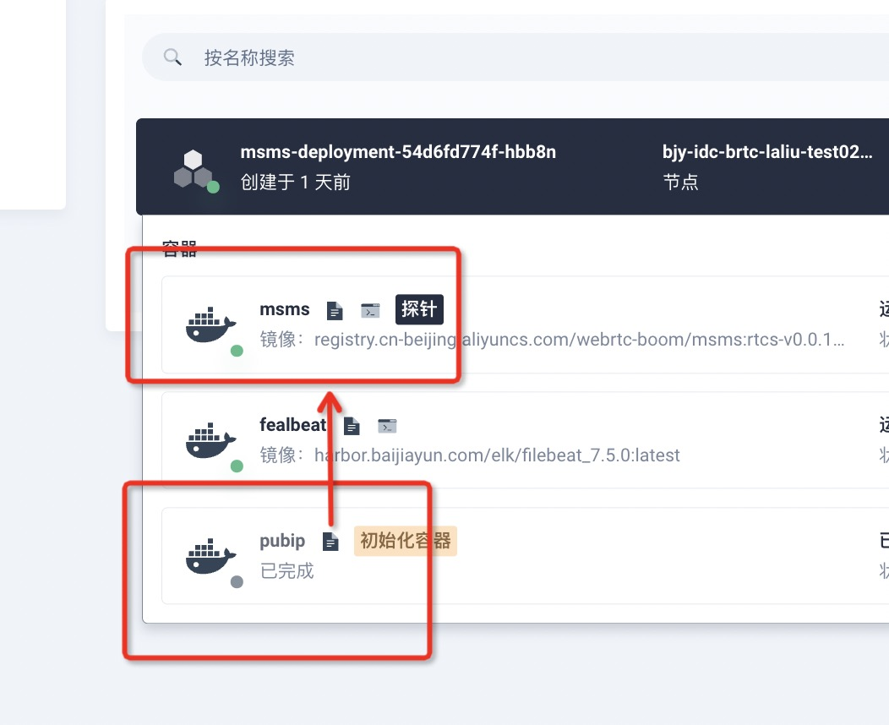

# Init-Containers

```yaml
     initContainers:
        - name: pubip
          image: 'harbor.baijiayun.com/sidecar/pubip:0.0.7'
          env:
            - name: Chioce
              value: '1'
            - name: NodeName
              valueFrom:
                fieldRef:
                  apiVersion: v1
                  fieldPath: spec.nodeName
          resources: {}
          volumeMounts:
            - name: ip-volume
              mountPath: /root/externalIp
      containers:
        - name: msms
          image: >-
            registry.cn-beijing.aliyuncs.com/webrtc-boom/msms:rtcs-v0.0.18-newms2-prod
          command:
            - sh
          args:
            - '-c'
            - /var/lib/externalIp/startup.sh
```
